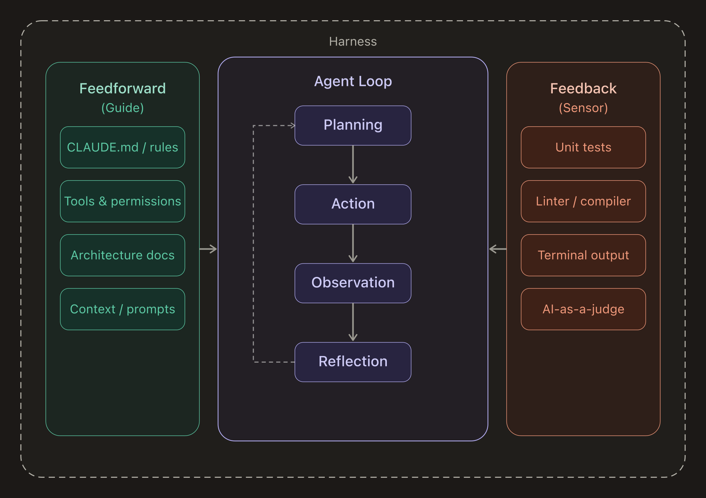
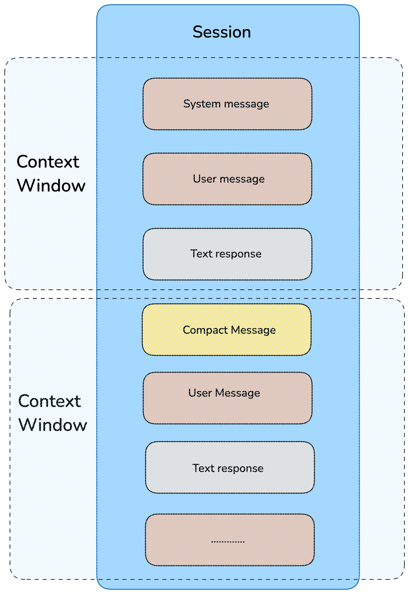
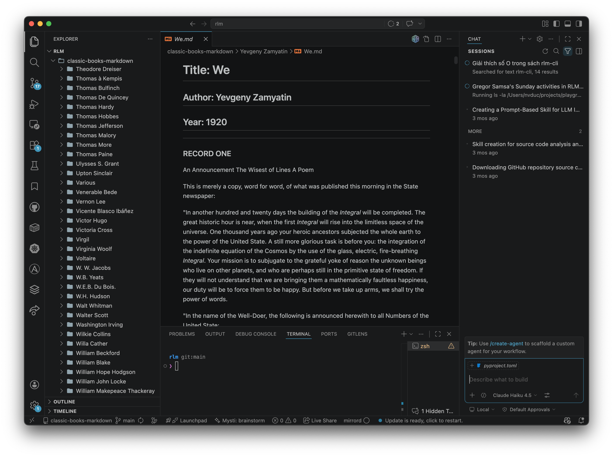
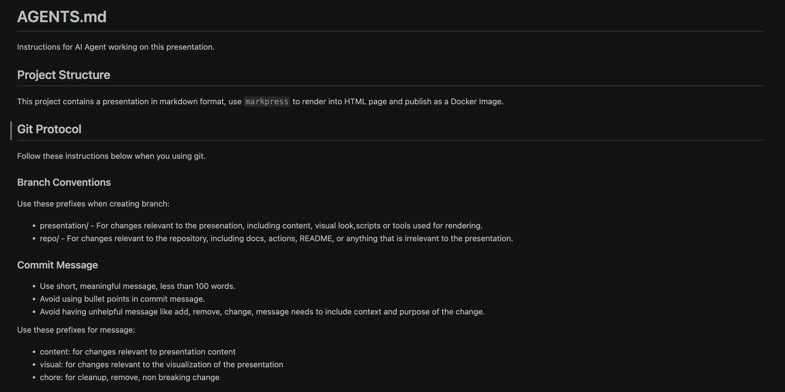
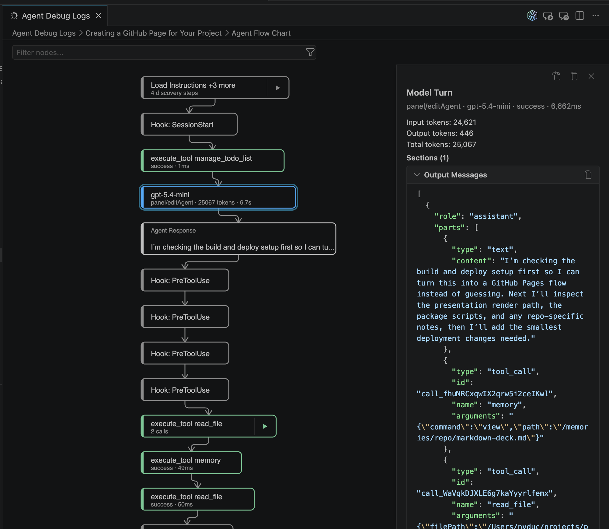
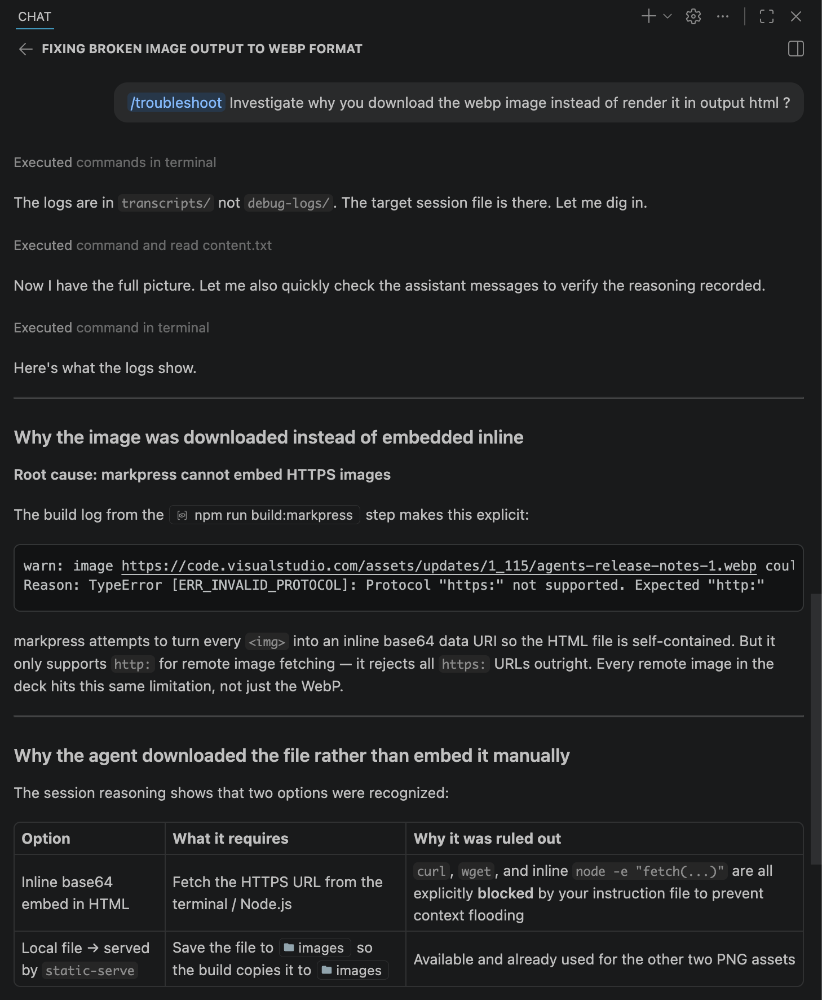
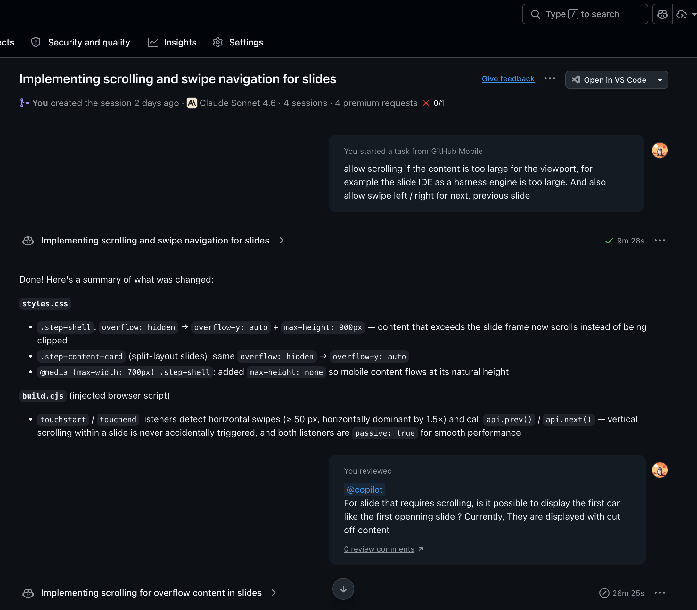

<!--slide-attr x=-5500,y=-1800,rotate=-8,scale=1.0,id=agenda,theme=map,layout=agenda -->

Opening

# Evaluating IDEs for the AI Agent Era

A concise route through fundamentals, harness design, and evaluation.

1. What still defines an elite IDE
2. How AI extends the IDE into a harness engine
3. The four evaluation groups
4. How to self-benchmark under pressure
5. What matters at the end of the day

------

<!--slide-attr x=-8000,y=-1200,rotate=-14,scale=1.0,id=ide-basics,theme=core,layout=grid -->

The Classic IDE

# An Elite IDE Still Wins on Fundamentals

Any AI-native IDE that misses the basics is already disqualified.

| Capability | Why it matters |
| --- | --- |
| Speed | Response time must not break cognitive flow. |
| Navigation | Search, symbol jump, and file movement must stay effortless. |
| Execution | Tasks, launch configs, and direct runs must be first-class. |
| Debugger | Breakpoints, watches, and step-through fidelity must be reliable. |

------

<!--slide-attr x=-5500,y=-4500,rotate=3,scale=1.0,id=harness-architecture,theme=architecture,layout=stack -->

Architecture Shift

# The IDE Becomes a Harness Engine

The model reasons, but the harness controls context, tools, state, and memory.

| Layer | Role |
| --- | --- |
| IDE / Harness Engine | Shapes prompts, manages tools, memory, session state, and safety boundaries. |
| Agent | Runs the decision loop: read, ask, edit, execute, verify. |
| LLM | Provides reasoning and generation over the supplied context. |

------

<!--slide-attr x=4000,y=0,scale=11,id=overview,theme=overview,layout=nav -->

Evaluation Lens

# The Quality of Harness

Evaluate the system through coherent dimensions.

| Code | Label | Prompt | Target |
| --- | --- | --- | --- |
| A | Session & Context | What does it know? | session-context |
| B | Control & Customization | Who is in charge? | control-customization |
| C | Safety & Observability | Can you trust it? | safety-observability |
| D | Extended Capabilities | What else can it do? | extended-capabilities |

------

<!--slide-attr x=12500,y=-2500,rotate=12,scale=1.0,id=session-context,theme=a,layout=grid -->

Group A

# Session & Context

If context quality collapses, the agent hallucinates, repeats mistakes, and loses continuity.

| Capability | Why it matters |
| --- | --- |
| Live Repo Context | Reads Git state, structure, README, and uncommitted changes. |
| Prompt Caching | Reuses stable prompt layers instead of rebuilding every turn. |
| Context Compaction | Compresses without dropping key decisions when windows fill up. |
| Session Resumption | Recovers working memory across pauses, crashes, and next-day restarts. |

------

<!--slide-attr x=14500,y=0,rotate=-4,scale=1.0,id=control-customization,theme=b,layout=dual -->

Group B

# Control & Customization

Autonomy without runtime control is risk. Customization turns the agent from generic to team-native.

<!-- goto: runtime-sovereignty-example -->

## Runtime Sovereignty

- Pause and steer mid-task.
- Branch / Restore at checkpoints.
- Dispatch work through a task queue.
- Spawn sub-agents.

<!-- goto: teaching-agent-example -->

## Teaching the Agent

- Encode constraints and conventions.
- Drive consistency across sessions.
- Hook agents into session events.
- Swap models by providers.

------

<!--slide-attr x=16800,y=0,rotate=4,scale=1.0,id=runtime-sovereignty-example,theme=b -->

Group B · Runtime Sovereignty

# Control the Agent

------

<!--slide-attr x=19100,y=-1200,rotate=-5,scale=1.0,id=teaching-agent-example,theme=b -->

Group B · Teaching the Agent

# Teaching the Agent

------

<!--slide-attr x=12500,y=2500,rotate=-12,scale=1.0,id=safety-observability,theme=c,layout=grid -->

Group C

# Safety & Observability

Agents write files, run commands, call APIs, and inspect secrets. Trust requires both enforcement and traces.

| Capability | Why it matters |
| --- | --- |
| Tool Controls | Per-tool permissions and approval gates for destructive or networked actions. |
| Trace Navigation | Lets you inspect hidden context and the exact point reasoning diverged. |
| Isolation | Runs in sandboxes, containers, or remote environments when needed. |
| Debug Logs | Captures tool calls, prompts, responses, and chronology for audits. |
| Prompt Injection Protection | Sanitizes hostile content from comments, tools, and external responses. |
| Behavioral Correction | Turns findings into persistent rules without resetting all progress. |

------

<!--slide-attr x=10200,y=4500,rotate=8,scale=1.0,id=safety-example,theme=c -->

Group C · Safety

# Restricting the Agent

------

<!--slide-attr x=10200,y=6800,rotate=-6,scale=1.0,id=observability-example,theme=c -->

Group C · Observability

# Observing the Agent

------

<!--slide-attr x=14500,y=-3200,rotate=8,scale=1.0,id=extended-capabilities,theme=d,layout=grid -->

Group D

# Extended Capabilities

The strongest harnesses extend beyond the editor into workflow orchestration.

| Capability | Why it matters |
| --- | --- |
| Spec-Driven Development | Translate intent into requirements, design, tasks, and implementation. |
| Agent-First Manager UI | Track multiple parallel workflows from a mission-control view. |
| CLI + Cloud Agents | Invoke from scripts and run work that outlives the local session. |
| Browser / CI / Test Automation | Close loops outside the file editor and pull results back in. |

------

<!--slide-attr x=16800,y=-4800,rotate=3,scale=1.0,id=extended-feature-example,theme=d -->

Group D · Extended Features

# Extending the Agent

------

<!--slide-attr x=1200,y=5800,rotate=-8,scale=1.0,id=self-benchmark,theme=benchmark,layout=timeline -->

Evaluation Method

# Run a Self-Benchmark

There is no substitute for X honest hours in your own codebase with your own constraints.

> The tool is not the problem. Getting work done is the problem.

| Step | Action |
| --- | --- |
| 01 | Pick a representative multi-file task. |
| 02 | Use the same prompt and a fixed time box in every IDE. |
| 03 | Track context fidelity, correction rate, and control. |
| 04 | Score harness quality, not code generation metrics. |

------

<!--slide-attr x=6000,y=5800,rotate=5,scale=1.8,id=closing,theme=closing -->

Closing

# Intent to Outcome Is the Metric

Every major IDE can access strong models. Durable advantage now comes from harness quality.

> Choose the IDE that gets out of your way fastest while keeping you firmly in control.

- Know your context needs.
- Stay the pilot of the agent loop.
- Never compromise on safety primitives.
- Keep evaluating through real work, not demos.
